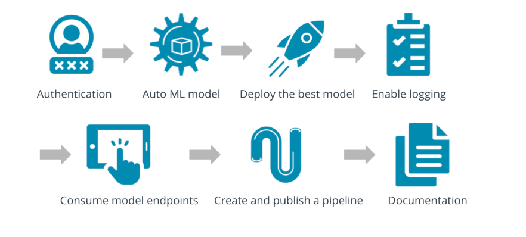
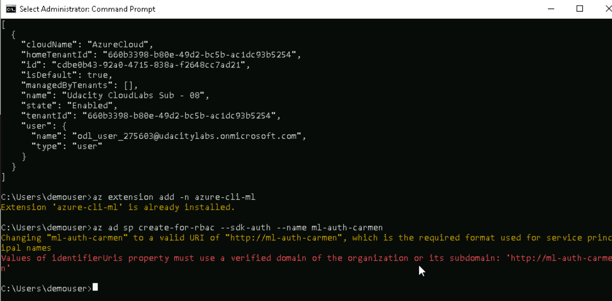
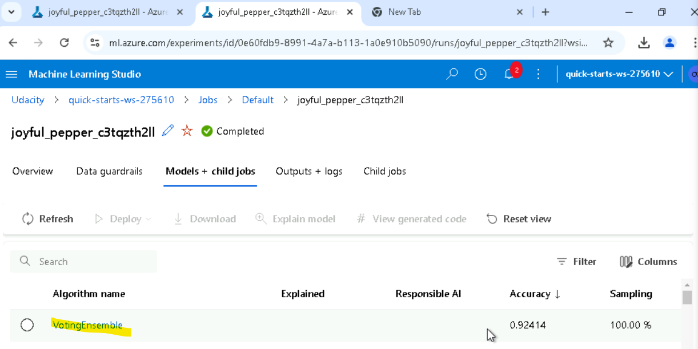
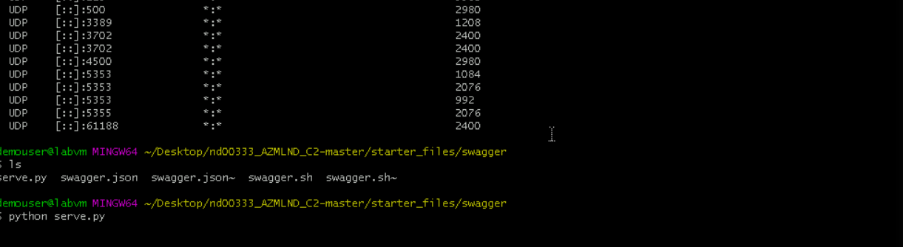

# Bank Marketing Dataset Project

In this project, I worked with the **Bank Marketing dataset** to configure, deploy, and consume a cloud-based machine learning production model using **Azure**. I used **Automated Machine Learning (AutoML)** to train and select the best model, and I deployed it as a REST endpoint. Additionally, I created, published, and consumed a pipeline to automate the workflow. Finally, I documented all my work in this **README file**.

---

## Project Overview

In this project, I used **Azure Machine Learning** to build and deploy a machine learning model. Here’s an overview of what I accomplished:

1. **Automated Machine Learning (AutoML)**:
   - I configured and ran an AutoML experiment using a **Jupyter Notebook** in Azure Machine Learning Studio. This allowed me to automatically train and evaluate multiple models to find the best-performing one.
   - I also ran the AutoML experiment **manually via the terminal** to understand the process from a different perspective.

2. **Model Deployment**:
   - After identifying the best model, I deployed it as a **web service** using Azure. This created a REST endpoint that could be consumed to make predictions.

3. **Testing the Endpoint**:
   - I tested the deployed model using **Swagger**, which provided an interactive interface to send requests to the endpoint and validate its functionality.
   - The endpoint was also consumed in terminal in endpoint.py and in the notebook.

4. **Pipeline Creation**:
   - I created and published a **pipeline** to automate the entire workflow, from data preprocessing to model deployment. This made the process reproducible and scalable.

5. **Documentation**:
   - I documented all the steps, including screenshots and explanations, in this **README file** to demonstrate my work.

## Architectural Diagram

Below is an architectural diagram that illustrates the different components of the project and their interactions:

### Components:
1. **Authentication**:
   - Set up authentication to access Azure services.
   In this course, I did not have the necessary privileges to create authentication (e.g., create Role-Based Access Control - RBAC). However, you can refer to the image below to see the code required for setting up authentication.

   **Note**: If I had the required privileges, a JSON file containing authentication information would have been generated for me. This file typically includes details such as subscription IDs, tenant IDs, and client secrets, which are essential for accessing Azure services programmatically.

   

2. **AutoML**:
   - Used Azure AutoML to train and evaluate multiple models. I ran the experiment both in a **Jupyter Notebook** and **manually via the terminal**.

3. **Deploy the Best Model**:
   - Deployed the best-performing model as a REST endpoint using Azure Machine Learning. This allowed me to make predictions by sending HTTP requests to the endpoint. In this scenario we have VontingEnsemble for the best model as showed in the image below.
    

4. **Enable Logging**:
   - Enabled logging to monitor the deployed model’s performance and usage. I retrieved and analyzed logs to ensure the model was functioning correctly and to troubleshoot any issues.

5. **Consume Endpoints**:
   - Consumed the deployed model’s REST endpoint to make predictions. I sent sample data to the endpoint and received predictions in real-time.

6. **Create and Publish a Pipeline**:
   - Created and published a pipeline to automate the entire workflow, from data preprocessing to model deployment. This made the process efficient and reproducible.

7. **Documentation**:
   - Documented the entire process, including how to set up the environment, run experiments, deploy models, and consume endpoints. I also included screenshots and a screencast video to demonstrate the workflow.

---

## Challenges and Improvements

During the project, I faced a few challenges and identified areas for improvement:

1. **Swagger and Local Server**:
   - I successfully connected Swagger to the localhost to test the REST endpoint. However, I encountered issues when trying to run the `serve.py` script, which was supposed to serve the `swagger.json` file. Despite debugging, the script did not show the expected HTTP connection, as shown in the image below. This is a point for future improvement.
  

2. **Logging**:
   - While I was able to enable logging and retrieve logs from the deployed model, I noticed that the logs could be more detailed. Enhancing the logging mechanism would make it easier to monitor and troubleshoot the model in production.

3. **Pipeline Optimization**:
   - The pipeline I created works well, but it could be optimized further to handle larger datasets and more complex workflows. Using advanced pipeline configurations and integrating with other Azure services could improve performance.

## Conclusion

This project allowed me to gain hands-on experience with **Azure Machine Learning**, from training models using AutoML to deploying and consuming them via REST endpoints. I also learned how to create and publish pipelines to automate workflows. By documenting my work in this README file, I hope to provide a clear and comprehensive overview of the project.

Feel free to explore the code, screenshots, and video to see the project in action! 🚀

