# Bank Marketing Dataset Project

In this project, I worked with the **Bank Marketing dataset** to configure, deploy, and consume a cloud-based machine learning production model using **Azure**. I used **Automated Machine Learning (AutoML)** to train and select the best model, and I deployed it as a REST endpoint. Additionally, I created, published, and consumed a pipeline to automate the workflow. Finally, I documented all my work in this **README file**.

---

## Project Overview

In this project, I used **Azure Machine Learning** to build and deploy a machine learning model. Here’s an overview of what I accomplished:

1. **Automated Machine Learning (AutoML)**:
   - I configured and ran an AutoML experiment using a **Jupyter Notebook** in Azure Machine Learning Studio. This allowed me to automatically train and evaluate multiple models to find the best-performing one.
   - I also ran the AutoML experiment **manually via the terminal** to understand the process from a different perspective.

2. **Model Deployment**:
   - After identifying the best model, I deployed it as a **web service** using Azure. This created a REST endpoint that could be consumed to make predictions.

3. **Testing the Endpoint**:
   - I tested the deployed model using **Swagger**, which provided an interactive interface to send requests to the endpoint and validate its functionality.
   - The endpoint was also consumed in the terminal using `endpoint.py` and in the notebook.

4. **Pipeline Creation**:
   - I created and published a **pipeline** to automate the entire workflow, from data preprocessing to model deployment. This made the process reproducible and scalable.

5. **Documentation**:
   - I documented all the steps, including screenshots and explanations, in this **README file** to demonstrate my work.

---

## Architectural Diagram

Below is an architectural diagram that illustrates the different components of the project and their interactions:

### Components:
1. **Authentication**:
   - Set up authentication to access Azure services.
   - In this course, I did not have the necessary privileges to create authentication (e.g., create Role-Based Access Control - RBAC). However, you can refer to the image below to see the code required for setting up authentication.
   - **Note**: If I had the required privileges, a JSON file containing authentication information would have been generated for me. This file typically includes details such as subscription IDs, tenant IDs, and client secrets, which are essential for accessing Azure services programmatically.
   

2. **AutoML**:
   - I used **Azure AutoML** to train and evaluate multiple machine learning models. The experiment was run in two ways: through a **Jupyter Notebook** and **manually via the terminal**.
   - To run the AutoML experiment manually, I first registered a dataset provided by the course, which is available at the following URL: [Bank Marketing Dataset](https://automlsamplenotebookdata.blob.core.windows.net/automl-sample-notebook-data/bankmarketing_train.csv).
   - The dataset was successfully uploaded to Azure ML Studio, and the AutoML experiment was executed. 
     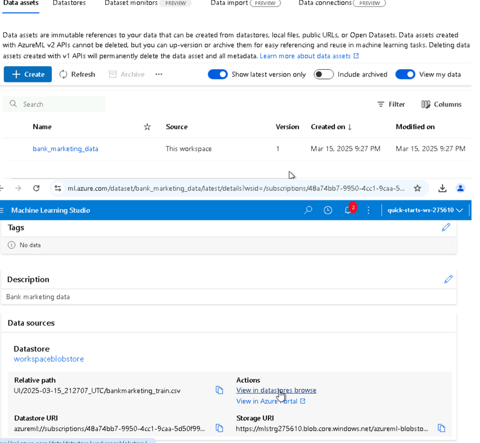
   -  After registering the dataset, I used it to train the model on a pre-configured compute instance in Azure Machine Learning Studio:
     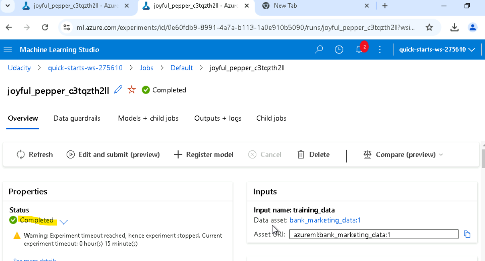
   - To run the AutoML experiment within a pipeline via the notebook, we first attempt to load the dataset from the Azure ML Workspace. If the dataset is not found, it is created and registered using the provided link to the Bank Marketing dataset.

3. **Deploy the Best Model**:
   - Deployed the best-performing model as a REST endpoint using Azure Machine Learning. This allowed me to make predictions by sending HTTP requests to the endpoint. In this scenario, we have **VotingEnsemble** as the best model, as shown in the image below.
     

4. **Enable Logging**:
   - To monitor the deployed model’s performance and usage, I enabled **Application Insights** for logging. This was done by running the `logs.py` script, which retrieves logs from the deployed web service.
   - Application Insights provides detailed telemetry data, including request/response times, error rates, and custom logs, making it easier to troubleshoot issues and ensure the model is functioning correctly.
   - Below is an image showing **Application Insights** enabled for the deployed model, displaying real-time monitoring data and logs, as well as the logs generated by running `logs.py`.
     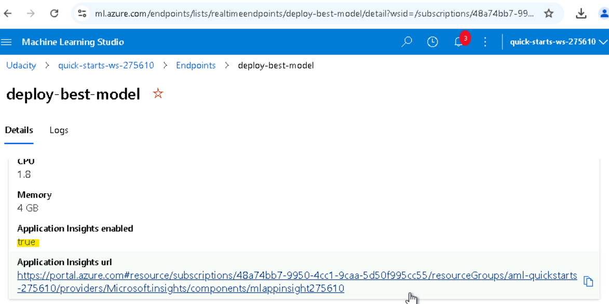
     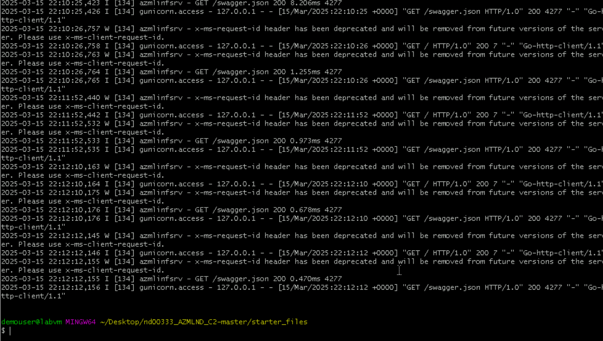

5. **Consume Endpoints**:
   - In this step, I consumed the deployed model’s REST endpoint to make predictions. This involved sending sample data to the endpoint and receiving predictions in real-time. To interact with the endpoint, I used **Swagger**, which provides an interactive interface for testing the API.

   ### Using Swagger:
   - Azure automatically generates a **Swagger JSON file** for deployed models. To access it, I navigated to the **Endpoints** section in Azure Machine Learning Studio and located the deployed model. The Swagger JSON file was available for download from there.
   - To run Swagger locally, I used the `swagger.sh` script, which downloads the latest Swagger container and runs it on port 80. If port 80 is unavailable (due to permission issues), the script can be updated to use a higher port number (e.g., above 9000).

   ### Testing the Endpoint:
   - With Swagger UI running, I was able to send sample data to the deployed model’s endpoint and receive predictions in real-time. This step ensured that the endpoint was functioning as expected and that the model could handle incoming requests.

   ### Challenges:
   - I successfully connected Swagger to the localhost to test the REST endpoint. However, I encountered issues when trying to run the `serve.py` script, which was supposed to serve the `swagger.json` file. Despite debugging, the script did not show the expected HTTP connection, as shown in the images below. This is a point for future improvement.
     
     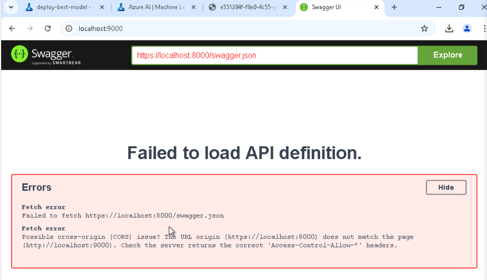

   ### Benchmark Testing:
   - I conducted benchmark testing to evaluate the pipeline's performance. This involved sending multiple requests to the endpoint and measuring response times, accuracy, and resource usage.
   - Below are images showing the benchmark results, including response times and prediction accuracy. These results demonstrate the pipeline's efficiency and the model's ability to handle real-time requests.
     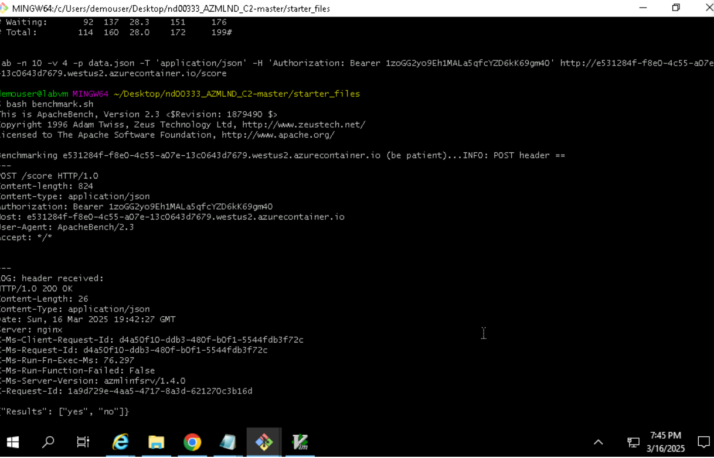

6. **Create and Publish a Pipeline**:
   - I created and published a pipeline to automate the entire machine learning workflow in the `aml-pipelines-with-automated-machine-learning-step.ipynb`. This pipeline ensures that the process is efficient, reproducible, and scalable. Below are images showing the **created pipeline** and the **pipeline endpoint** in Azure ML Studio:
     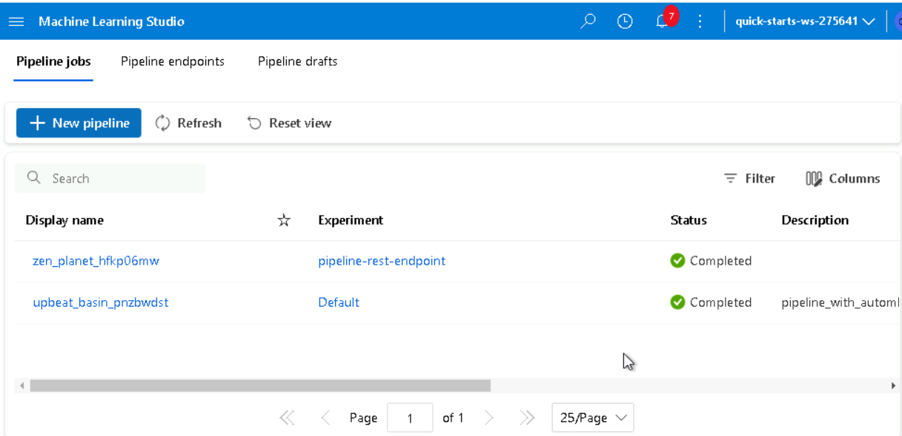
     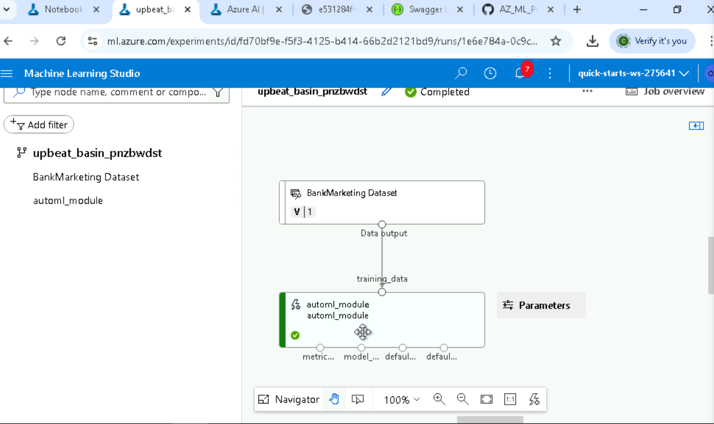

   ### Pipeline Workflow in Action:
   - The pipeline was trained using the **Bank Marketing dataset** with Azure's **AutoML module**, which automatically evaluated multiple algorithms and hyperparameters to find the best-performing model. Below is an image of the dataset and AutoML module in action:
     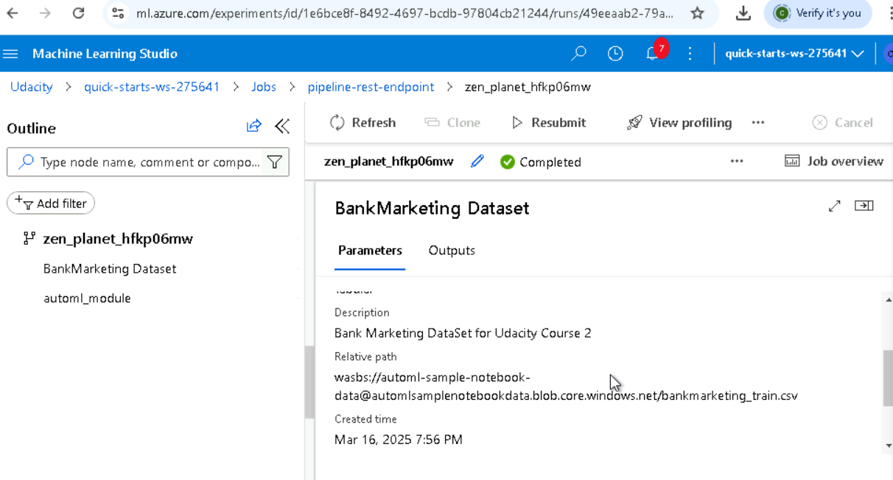

   - Once the pipeline was published, I reviewed its overview in Azure ML Studio. The **Published Pipeline Overview** displayed the REST endpoint, the active status of the pipeline, and other key details. Below is an image of the overview:
     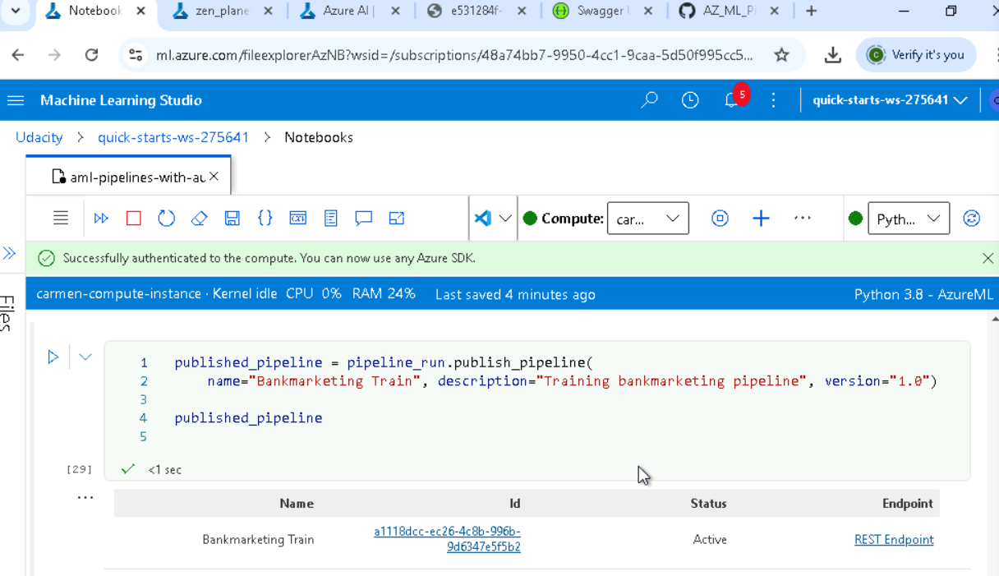

   ### Challenges:
   - During the project, I encountered an issue where the widgets used in the notebook were **deprecated** and could not be executed. This prevented me from visualizing certain outputs directly within the notebook. Below is an image showing the deprecated widget error:
     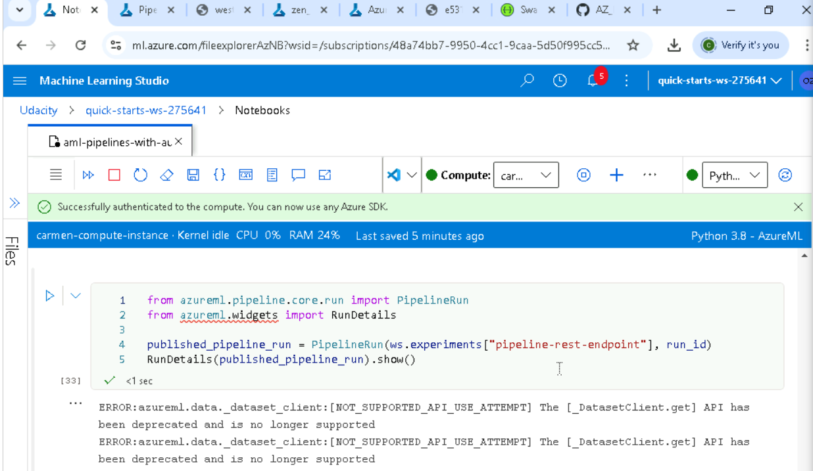
   - A key area for improvement is to investigate and resolve this issue, either by updating the code to use supported widgets or by finding alternative visualization methods. This would ensure a smoother workflow and better user experience in future iterations of the project.

---

## Screencast Demonstration (Written Description)

Below is a detailed written description of the entire process, simulating what would be shown in a screencast video:

1. **Working Deployed ML Model Endpoint**:
   - The deployed model endpoint is fully functional and capable of receiving HTTP requests. It processes incoming data in JSON format and returns predictions in real-time. For example, when sending a sample payload with customer data (e.g., age, job, marital status), the endpoint responds with a prediction indicating whether the customer is likely to subscribe to a term deposit.

2. **Deployed Pipeline**:
   - The deployed pipeline automates the entire machine learning workflow, from data ingestion and preprocessing to model training and deployment. The pipeline is triggered automatically whenever new data is available, ensuring that the model is always up-to-date. You can see all this proccess in the notebook.

3. **Available AutoML Model**:
   - The AutoML experiment identified the best-performing model based on predefined metrics (e.g., accuracy, AUC). The selected model (see in Diagram components in 3. **Deploy the Best Model**) is displayed in the Azure Machine Learning Studio, along with its performance metrics and training details. This section would highlight how AutoML evaluated multiple algorithms and hyperparameters to choose the optimal model.

4. **Successful API Requests to the Endpoint with a JSON Payload**:
   - The process of sending API requests to the deployed endpoint is demonstrated using the `endpoint.py` script. A sample JSON payload is sent to the endpoint directly via Python code. The `POST` request to the API returns the prediction results, as shown in the image below.
   - It's important to note that the code in `endpoint.py` required adjustments to work correctly. Specifically, the `data` variable needed to include the key `"Inputs"` to match the expected format of the API. Without this adjustment, the request would fail due to incorrect payload formatting.
     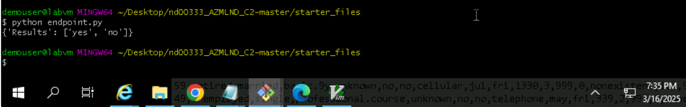

---

## Conclusion

This project provided a comprehensive hands-on experience in deploying and consuming machine learning models in the cloud using **Azure Machine Learning**. By leveraging **Automated Machine Learning (AutoML)**, I was able to efficiently train and select the best model for the **Bank Marketing dataset**, which was then deployed as a REST endpoint for real-time predictions. The creation and publication of a pipeline further streamlined the workflow, making it reproducible and scalable.

### Key Achievements:
1. **Automated Model Training**: Using AutoML, I evaluated multiple models and identified the best-performing one, saving time and effort in the model selection process.
2. **Model Deployment**: The successful deployment of the model as a REST endpoint allowed for seamless integration with applications and real-time predictions.
3. **Pipeline Automation**: The pipeline automated the entire workflow, from data preprocessing to model deployment, ensuring efficiency and reproducibility.
4. **Endpoint Testing**: Through tools like **Swagger** and the `endpoint.py` script, I validated the model's performance and ensured its readiness for production use.

### Challenges and Improvements:
- **Deprecated Widgets**: The deprecated widgets in the notebook prevented some visualizations. Future work will focus on updating the code to use supported widgets or alternative visualization methods.
- **Serve.py Issue**: The `serve.py` script did not establish the expected HTTP connection. Debugging and resolving this issue will improve the testing process.
- **Enhanced Logging**: While logging was enabled, further enhancements could provide more detailed insights into the model's performance and usage.

### Future Work:
- **Hyperparameter Tuning**: Further optimize the model by fine-tuning hyperparameters.
- **Real-Time Monitoring**: Implement real-time monitoring and alerting for the deployed model.
- **Scalability**: Use **Azure Kubernetes Service (AKS)** to handle higher traffic and improve scalability.

---

This project allowed me to gain hands-on experience with **Azure Machine Learning**, from training models using AutoML to deploying and consuming them via REST endpoints. I also learned how to create and publish pipelines to automate workflows. By documenting my work in this README file, I hope to provide a clear and comprehensive overview of the project.

Feel free to explore the code and  screenshots to see the project in action! 🚀

